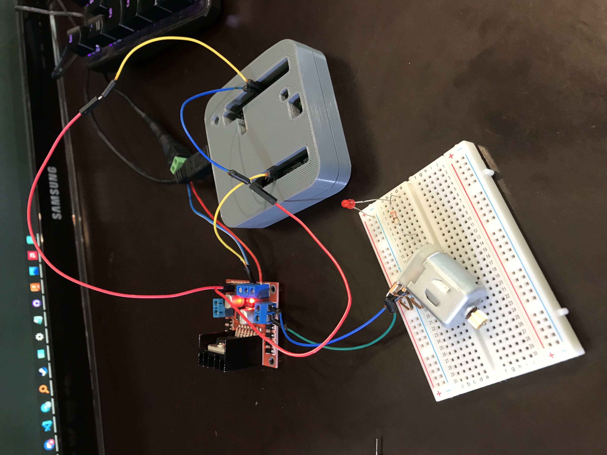

# **Sliding Table  - psuedo CNC thing.**

This is a basic school project using some electronics w/ [Arduino!](https://www.arduino.cc/) 💻🤖

## **Task**

1. Create a prototype ✅ (02.12.2022)
2. Create a second prototype with buttons, limit switches etc. (03.12.2022) ✅ 
3. Implement a prototype to a real thing! 😎 ❌

## **Used components:**
* Arduino Uno R3
* L298N - Motor Driver Module
* Motor - 12V DC
* Wires
* 3D printed case
* limit switch / x2
* Power supply 12V DC
* LEDS 

## **Prototypes** ##

* Prototype 1 

    Here is the first ever idea of ​​building this. 
    

    Simple circuit just to test if everything is fine.

